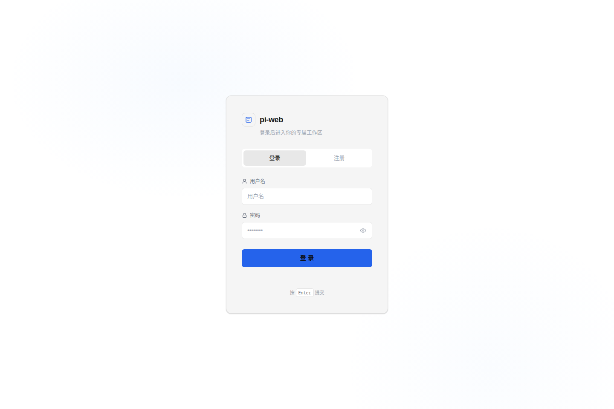
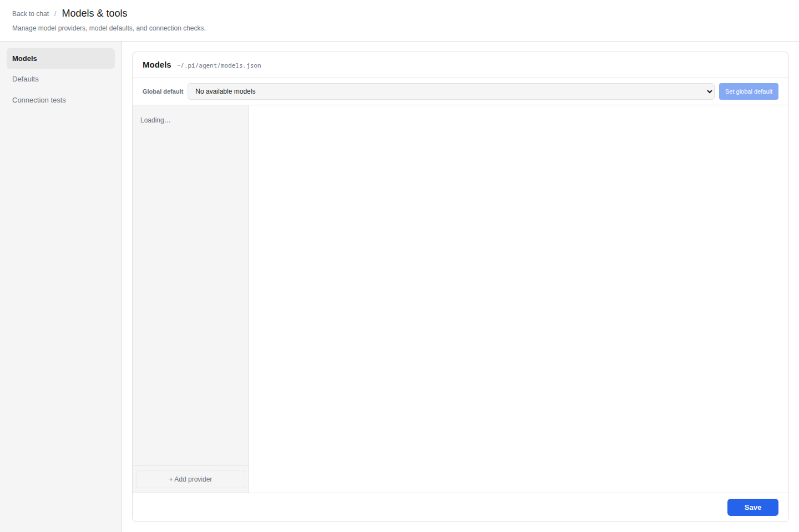

# pi-web-auth-public

[中文文档](./README-zh.md)

Public multi-user fork of the Pi coding agent web UI. It adds login, per-user workspaces, session browsing, streaming chat, model switching, file upload/download, and an admin console on top of the Pi agent runtime.

## Upstream And Attribution

This project is based on [`agegr/pi-web`](https://github.com/agegr/pi-web), the local web UI for the Pi coding agent. The original project is licensed under the MIT License.

This fork keeps the upstream license and attribution, and adds a multi-user, authenticated, operations-oriented layer for private team deployments. The main product direction of this fork is user isolation, role-based administration, document upload/download workflows, and safer standalone production releases.

Development lineage: this public package comes from a private `pi-web` development line that was forked from upstream `agegr/pi-web` `main` at commit `722f7096a36dab68e00afdd4aa6f6698066cc364` (`chore: refresh npm lockfile metadata`, 2026-05-31). That private line added document upload/download, service deployment notes, local model configuration notes, HTTPS/service fixes, and recent workspace history before it was extended into this authenticated `pi-web-auth-public` fork. At the time this README was prepared, upstream `main` had continued past that baseline, so this fork should be treated as a feature fork rather than a drop-in mirror of the latest upstream release.

If you need the original single-user local `pi-web` experience, use [`agegr/pi-web`](https://github.com/agegr/pi-web). If you need login, per-user workspaces, admin controls, and production release tooling, use this fork.

## Features

- User login and registration with `user`, `admin`, and `super_admin` roles
- Per-user workspace isolation under `~/pi-users/<username>`
- Read-only session browsing from `~/.pi/agent/sessions`
- Streaming chat with reconnect support
- Model configuration and in-chat model switching
- Tool presets: `off`, `default`, and `full`
- File explorer, file preview, uploads, and generated-file downloads
- Admin console for user management and read-only observability
- Optional standalone release scripts for production deployments

## Screenshots

### Authenticated Team Entry



The login screen is the main entry point for shared deployments. It reflects the fork's added authentication layer, registration gate, role bootstrap flow, and private team access model.

### Models And Tool Presets



The models and tools settings page shows the added operations surface for configuring providers, model availability, compatibility options, and tool presets used by authenticated users in chat.

## Additions Compared With `agegr/pi-web`

This project started from the public `agegr/pi-web` web UI and adds a multi-user, operations-oriented product layer. The main additions are:

- **Authentication and registration**: users must log in before accessing sessions, files, models, or chat. Registration can be protected with `REGISTER_KEYWORD`.
- **Role-based access control**: `user`, `admin`, and `super_admin` roles are enforced on both the UI and API routes.
- **Per-user workspace isolation**: ordinary users are scoped to `~/pi-users/<username>` and cannot browse arbitrary local projects owned by other users.
- **Admin console**: `/admin` adds user management, role changes, disable/delete flows, session visibility, workspace visibility, file read-only browsing, and audit/overview pages.
- **Session ownership index**: session metadata is indexed with ownership, archive/favorite/tag metadata, search support, orphan detection, and admin-visible observability.
- **User model preferences**: users can save personal default models without changing the global model registry.
- **Chat input hardening for internal multi-user use**: model selection, thinking level, tool preset, compact, attachment upload, and completion sound are kept in the chat surface with server-side authorization checks behind the APIs.
- **Document upload and download**: documents and spreadsheets can be uploaded into the current workspace `uploads/` directory, referenced automatically in the prompt, previewed from the file browser, and downloaded again from the web UI.
- **Release lifecycle APIs**: internal drain/resume and health endpoints support safer production transitions.
- **Standalone production release tooling**: scripts build immutable releases, stage-verify them, switch `current`/`previous` symlinks, keep release metadata, and roll back code on failed readiness.
- **Production backup and restore tooling**: release scripts take SQLite-aware data backups, keep verified backup manifests, support dry-run restore, and keep code rollback separate from data restore.
- **Expanded automated coverage**: auth, ownership, admin observability, session index, release, and UI smoke tests were added around the multi-user and production workflows.

Some upstream `agegr/pi-web` features are intentionally not the focus of this fork, including the npm `pi-web` CLI distribution flow, plugin/worktree-specific endpoints, and some Markdown/file-rendering enhancements. This fork prioritizes authenticated internal/team deployment, user isolation, and production operations.

## Requirements

- Node.js 22 or newer
- npm
- git
- rsync, curl, and systemd for production release scripts
- A working Pi agent runtime from `@earendil-works/pi-coding-agent`

## Deployment Paths Explained

Most configuration paths are relative to the process `HOME`.

| Runtime mode | `HOME` points to | Example path for `~/.pi/agent/models.json` |
| --- | --- | --- |
| Local development | Your shell user's home directory | `/home/alice/.pi/agent/models.json` |
| Simple production shell | The `HOME` value in the shell that runs `npm run start` | Depends on the service user |
| Example systemd unit | `/var/lib/pi-web-auth` | `/var/lib/pi-web-auth/.pi/agent/models.json` |
| User-level systemd unit | The Linux user's home directory | `/home/piweb/.pi/agent/models.json` |

When following the production examples in this README, treat `/var/lib/pi-web-auth` as the application data home. That means `~/.pi/agent/models.json` becomes `/var/lib/pi-web-auth/.pi/agent/models.json`.

## Local Development

Install dependencies:

```bash
npm install
```

Start the development server:

```bash
npm run dev
```

The app listens on `http://localhost:8000` by default. For isolated development, use a dedicated `HOME` and a non-production port:

```bash
HOME=/tmp/pi-web-auth-dev-home npm run dev -- -p 8144
```

Do not run `next build` during routine development. Use it only for production builds.

## Verification

```bash
npm run typecheck
npm run lint
npm run verify
```

`npm run verify` runs typecheck, lint, auth tests, release tests, and UI tests.

## Runtime Data

Runtime data is stored outside the source repository:

- `~/.pi-web-auth/auth.db`: users, roles, disabled state, and login sessions
- `~/pi-users/<username>/`: per-user workspaces
- `~/.pi/agent/sessions/`: Pi session `.jsonl` files
- `~/.pi/agent/models.json`: model/provider configuration
- `~/.pi/agent/settings.json`: default model settings
- `~/.pi/agent/auth.json`: provider auth/API key storage managed by Pi

Do not commit these files to a public repository.

## Required Configuration

Before running a shared or production deployment, review these files and values:

| Area | File or variable | What to configure |
| --- | --- | --- |
| Registration | `REGISTER_KEYWORD` | Invitation keyword required for new users. Leave it unset only if registration should fail closed. |
| Super admin | `PI_WEB_SUPER_ADMIN_USERNAME` | Username that is always treated as `super_admin`; defaults to `admin`. |
| App data home | `HOME` | Controls where `.pi-web-auth/`, `pi-users/`, and `.pi/agent/` are stored. The example systemd unit uses `/var/lib/pi-web-auth`. |
| Release env | `/etc/pi-web-auth/release.env` | Production environment file loaded by systemd and release scripts. Store `REGISTER_KEYWORD`, `PI_WEB_RELEASE_TOKEN`, `PI_WEB_SUPER_ADMIN_USERNAME`, and any path overrides here. Set mode `0600`. |
| systemd unit | `systemd/pi-web-auth.service.example` | Copy to `/etc/systemd/system/pi-web-auth.service` and adjust `WorkingDirectory`, `EnvironmentFile`, `HOME`, `PORT`, `HOSTNAME`, `ExecStart`, and `ExecStop` if your install paths differ. |
| Model registry | `~/.pi/agent/models.json` | Providers, model IDs, display names, base URLs, compatibility flags, context windows, and provider API keys for custom providers. |
| Default model | `~/.pi/agent/settings.json` | `defaultProvider` and `defaultModel` used for new chats. |
| Provider auth | `~/.pi/agent/auth.json` | API keys managed by Pi's provider login/auth flow. Do not commit or share this file. |
| Upload limits | `PI_WEB_UPLOAD_MAX_MB`, `PI_WEB_UPLOAD_MAX_COUNT` | Maximum document size and count per upload. |
| Release paths | `PI_WEB_SOURCE_ROOT`, `PI_WEB_DEPLOY_ROOT`, `PI_WEB_BACKUP_ROOT`, `PI_WEB_PRODUCTION_HOME`, `PI_WEB_RELEASE_ENV` | Override the public defaults when installing outside `/opt/pi-web-auth`, `/var/lib/pi-web-auth`, or `/var/backups/pi-web-auth`. |

For OpenAI-compatible custom providers, the API key can be stored in the provider entry in `models.json` as `apiKey`. For providers authenticated through Pi's own login flow, keys are stored in `auth.json`. Both files are secrets and must stay outside Git.

Minimal `/etc/pi-web-auth/release.env` example:

```bash
REGISTER_KEYWORD=change-me
PI_WEB_RELEASE_TOKEN=<random-hex-token>
PI_WEB_SUPER_ADMIN_USERNAME=admin
PI_WEB_PRODUCTION_HOME=/var/lib/pi-web-auth
PI_WEB_SOURCE_ROOT=/opt/pi-web-auth/source
PI_WEB_DEPLOY_ROOT=/opt/pi-web-auth
PI_WEB_BACKUP_ROOT=/var/backups/pi-web-auth
```

## Important Environment Variables

- `REGISTER_KEYWORD`: invitation keyword required for registration
- `PI_WEB_SUPER_ADMIN_USERNAME`: username that should always be bootstrapped as `super_admin`; defaults to `admin`
- `PI_CODING_AGENT_DIR`: optional override for the Pi agent data directory
- `PI_WEB_UPLOAD_MAX_MB`: max uploaded document size, defaults to `50`
- `PI_WEB_UPLOAD_MAX_COUNT`: max documents per upload, defaults to `20`
- `PI_WEB_ALLOWED_DEV_ORIGINS`: comma-separated extra dev origins for Next.js, for example `192.168.1.10,devbox.local`

## Model Configuration

Admins can configure models from the **Models** panel. Configuration is stored in `~/.pi/agent/models.json`.

Minimal OpenAI-compatible provider example:

```json
{
  "providers": {
    "local-openai": {
      "baseUrl": "http://127.0.0.1:11434/v1",
      "api": "openai-completions",
      "apiKey": "local",
      "models": [
        {
          "id": "qwen2.5-coder:7b",
          "name": "Qwen2.5 Coder 7B (Local)"
        }
      ]
    }
  }
}
```

If your OpenAI-compatible server does not support developer messages or reasoning options, add compatibility settings:

```json
{
  "providers": {
    "local-openai": {
      "baseUrl": "http://127.0.0.1:11434/v1",
      "api": "openai-completions",
      "apiKey": "local",
      "compat": {
        "supportsDeveloperRole": false,
        "supportsReasoningEffort": false
      },
      "models": [
        {
          "id": "qwen2.5-coder:7b",
          "name": "Qwen2.5 Coder 7B (Local)",
          "reasoning": false,
          "input": ["text"],
          "contextWindow": 32768,
          "maxTokens": 8192
        }
      ]
    }
  }
}
```

Default model settings live in `~/.pi/agent/settings.json`:

```json
{
  "defaultProvider": "local-openai",
  "defaultModel": "qwen2.5-coder:7b"
}
```

## Production Options

### Recommended Deployment Flow

For a public or team-facing environment, use this order:

1. Prepare the host, data directories, and `/etc/pi-web-auth/release.env`.
2. Configure at least one model provider and default model under the production data home.
3. Run `npm run verify` from a clean checkout.
4. Start the app once with the simple production command to verify login and model configuration.
5. Install systemd service management for long-running operation.
6. Use standalone release scripts for later upgrades.

The simple production command is easier for the first smoke test. The standalone release flow is the better long-term production path because it builds immutable releases, verifies staging, keeps `current` and `previous`, and backs up data before switching versions.

### Prepare A Production Host

Install Node.js 22 or newer, npm, git, curl, rsync, and systemd. Then prepare the source, data, backup, and release configuration directories:

```bash
sudo mkdir -p /opt/pi-web-auth/source /opt/pi-web-auth/releases /opt/pi-web-auth/staging /opt/pi-web-auth/logs
sudo mkdir -p /var/lib/pi-web-auth/.pi/agent /var/lib/pi-web-auth/.pi-web-auth /var/lib/pi-web-auth/pi-users
sudo mkdir -p /var/backups/pi-web-auth /etc/pi-web-auth
sudo chown -R "$USER":"$USER" /opt/pi-web-auth /var/lib/pi-web-auth /var/backups/pi-web-auth
sudo install -m 600 /dev/null /etc/pi-web-auth/release.env
sudo chown "$USER":"$USER" /etc/pi-web-auth/release.env
```

Clone the project:

```bash
git clone https://github.com/luciferhs/pi-web.git /opt/pi-web-auth/source
cd /opt/pi-web-auth/source
npm ci
npm run verify
```

Write the production environment file:

```bash
cat > /etc/pi-web-auth/release.env <<'EOF'
REGISTER_KEYWORD=change-me
PI_WEB_RELEASE_TOKEN=replace-with-a-random-long-token
PI_WEB_SUPER_ADMIN_USERNAME=admin
PI_WEB_PRODUCTION_HOME=/var/lib/pi-web-auth
PI_WEB_SOURCE_ROOT=/opt/pi-web-auth/source
PI_WEB_DEPLOY_ROOT=/opt/pi-web-auth
PI_WEB_BACKUP_ROOT=/var/backups/pi-web-auth
PI_WEB_RELEASE_ENV=/etc/pi-web-auth/release.env
EOF
chmod 600 /etc/pi-web-auth/release.env
```

Generate a stronger release token before exposing the service:

```bash
openssl rand -hex 32
```

Replace `PI_WEB_RELEASE_TOKEN` with that value. Change `REGISTER_KEYWORD` before inviting users.

### Configure Models Before First Login

Create the model registry under the production `HOME`:

```bash
mkdir -p /var/lib/pi-web-auth/.pi/agent
nano /var/lib/pi-web-auth/.pi/agent/models.json
```

OpenAI-compatible example:

```json
{
  "providers": {
    "openai": {
      "baseUrl": "https://api.openai.com/v1",
      "api": "openai-completions",
      "apiKey": "replace-with-your-api-key",
      "models": [
        {
          "id": "gpt-5",
          "name": "GPT-5"
        }
      ]
    }
  }
}
```

Set the default model:

```bash
cat > /var/lib/pi-web-auth/.pi/agent/settings.json <<'EOF'
{
  "defaultProvider": "openai",
  "defaultModel": "gpt-5"
}
EOF
```

Use `apiKey` in `models.json` for custom OpenAI-compatible providers. Providers authenticated through Pi's own login flow store credentials in `/var/lib/pi-web-auth/.pi/agent/auth.json`.

Keep `models.json`, `settings.json`, and `auth.json` outside Git. They are runtime configuration files, not source files.

### First Smoke Test Without systemd

Run the app once from the source checkout to verify registration, login, and model loading:

```bash
cd /opt/pi-web-auth/source
set -a
source /etc/pi-web-auth/release.env
set +a
HOME=/var/lib/pi-web-auth npm run build
HOME=/var/lib/pi-web-auth npm run start
```

Open `http://<server-ip>:8000/login`.

Register the first super admin user with username `admin`, or the value configured in `PI_WEB_SUPER_ADMIN_USERNAME`. Use the `REGISTER_KEYWORD` value from `release.env`. The password is created in the registration form and is not stored in plaintext.

After login, open the Models panel and confirm the configured model appears. Start a test chat before moving to systemd.

### Simple Next.js Production Mode

For a small private deployment:

```bash
npm ci
npm run build
REGISTER_KEYWORD=change-me PI_WEB_SUPER_ADMIN_USERNAME=admin npm run start
```

This starts `next start -p 8000`.

### Standalone Release Scripts

The repository also includes scripts for immutable standalone releases:

- `scripts/build-release.sh`
- `scripts/release-production.sh`
- `scripts/restore-production-backup.sh`
- `systemd/pi-web-auth.service.example`

The public defaults use generic paths:

- source: `/opt/pi-web-auth/source`
- deploy root: `/opt/pi-web-auth`
- data home: `/var/lib/pi-web-auth`
- backups: `/var/backups/pi-web-auth`
- release env: `/etc/pi-web-auth/release.env`

Override them with environment variables such as `PI_WEB_SOURCE_ROOT`, `PI_WEB_DEPLOY_ROOT`, `PI_WEB_BACKUP_ROOT`, `PI_WEB_PRODUCTION_HOME`, and `PI_WEB_RELEASE_ENV`.

`/etc/pi-web-auth/release.env` should be mode `0600` and contain at least:

```bash
PI_WEB_RELEASE_TOKEN=<random-hex-token>
REGISTER_KEYWORD=<registration-keyword>
PI_WEB_SUPER_ADMIN_USERNAME=admin
```

### Managing The Service With systemctl

The example unit is designed for a standalone release at `/opt/pi-web-auth/current` and runs the app on port `8000` with `HOME=/var/lib/pi-web-auth`.

Install the unit for system-level management:

```bash
sudo cp systemd/pi-web-auth.service.example /etc/systemd/system/pi-web-auth.service
sudo systemctl daemon-reload
sudo systemctl enable pi-web-auth.service
```

Start, restart, stop, and inspect the service:

```bash
sudo systemctl start pi-web-auth.service
sudo systemctl status pi-web-auth.service --no-pager
sudo journalctl -u pi-web-auth.service -f
sudo systemctl restart pi-web-auth.service
sudo systemctl stop pi-web-auth.service
```

For a user-level service, copy the unit to `~/.config/systemd/user/pi-web-auth.service`, run `systemctl --user daemon-reload`, and use `systemctl --user start|status|restart|stop pi-web-auth.service`. Adjust `WorkingDirectory`, `EnvironmentFile`, `HOME`, and `ExecStart` if your install paths differ from the public defaults.

The release scripts use `systemctl --user` by default. If you want to use them unchanged, install the unit as a user-level service:

```bash
mkdir -p ~/.config/systemd/user
cp systemd/pi-web-auth.service.example ~/.config/systemd/user/pi-web-auth.service
systemctl --user daemon-reload
systemctl --user enable pi-web-auth.service
```

For long-running user services after logout, enable lingering for that Linux user:

```bash
sudo loginctl enable-linger "$USER"
```

### First Standalone Release

The first standalone release needs a managed release directory and a `current` symlink before the service can start from `/opt/pi-web-auth/current`:

```bash
cd /opt/pi-web-auth/source
set -a
source /etc/pi-web-auth/release.env
set +a
scripts/build-release.sh
```

The last line printed by `scripts/build-release.sh` is the release directory. Point `current` at it:

```bash
RELEASE_DIR=/opt/pi-web-auth/releases/<release-id>
ln -sfn "$RELEASE_DIR" /opt/pi-web-auth/current
```

Start the service:

```bash
systemctl --user start pi-web-auth.service
systemctl --user status pi-web-auth.service --no-pager
```

For later upgrades from a healthy standalone release, run:

```bash
cd /opt/pi-web-auth/source
git pull --ff-only
scripts/release-production.sh
```

The release script builds a new release, verifies it in staging, backs up production data, drains active work, switches the `current` symlink, starts the new release, checks readiness, and rolls back to `previous` if readiness fails.

### Health Checks

After starting the service, check the HTTP endpoints:

```bash
curl -fsS http://127.0.0.1:8000/api/health/live
curl -fsS http://127.0.0.1:8000/api/health/ready
```

Then open the login page from a browser:

```text
http://<server-ip>:8000/login
```

If the browser cannot connect, inspect the port and logs:

```bash
ss -ltnp | grep 8000
systemctl --user status pi-web-auth.service --no-pager
journalctl --user -u pi-web-auth.service -n 200 --no-pager
```

### Troubleshooting

| Symptom | Check |
| --- | --- |
| Registration fails | Confirm `REGISTER_KEYWORD` in `/etc/pi-web-auth/release.env` and use the same value on the registration page. |
| First user is not super admin | Confirm the registered username exactly matches `PI_WEB_SUPER_ADMIN_USERNAME`. |
| Models are missing | Confirm the service `HOME`; with the example unit, models must be in `/var/lib/pi-web-auth/.pi/agent/models.json`. |
| API key errors | Check `apiKey`, `baseUrl`, `api`, and provider compatibility flags in `models.json`. |
| systemd service fails to start | Check `WorkingDirectory`, `EnvironmentFile`, `HOME`, `ExecStart`, and whether `/opt/pi-web-auth/current/server.js` exists. |
| Uploads fail | Check `PI_WEB_UPLOAD_MAX_MB`, `PI_WEB_UPLOAD_MAX_COUNT`, workspace write permissions, and free disk space. |
| Release script cannot stop/start service | Install the service as a user-level unit or set `PI_WEB_SYSTEMCTL_BIN`/`PI_WEB_SERVICE_NAME` for your environment. |
| Ready check fails | Inspect `journalctl --user -u pi-web-auth.service -n 200 --no-pager` and verify `/var/lib/pi-web-auth/.pi-web-auth`, `/var/lib/pi-web-auth/pi-users`, and `/var/lib/pi-web-auth/.pi/agent` are writable. |

## Project Structure

```text
app/api/                 Next.js API routes
components/              React UI components
hooks/                   Frontend state hooks
lib/                     Server/client shared logic
scripts/                 Release, backup, and verification scripts
systemd/                 Example service unit
__tests__/               Node and Vitest tests
```

## Public Repository Hygiene

Before publishing a fork or copy, confirm the repository does not include:

- `.next/`
- `node_modules/`
- `.env*`
- `*.pem`
- `~/.pi-web-auth/*`
- `~/.pi/agent/auth.json`
- `~/.pi/agent/models.json`
- `~/.pi/agent/sessions/`
- `~/pi-users/`

Run a local scan before publishing:

```bash
rg -n -I 'sk-|api[_-]?key|secret|token|password|passwd|BEGIN .*PRIVATE KEY|PRIVATE KEY|Bearer|/home/|10\.|192\.168\.|\.pem|auth\.db|models\.json|auth\.json' .
```

Review matches manually. Code and documentation may legitimately mention tokens or passwords as concepts, but real values must not be committed.
